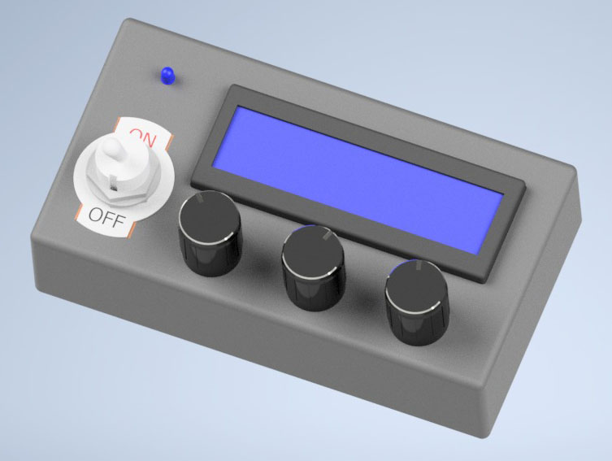

# Volume mixer
The volume mixer device allows one to adjust the master volume and the volume of two applications at the turn of a knob.

## PC side
### Prerequisites
Make sure Python and pip are installed.

Currently, only Windows PCs and (Linux) PCs using PulseAudio are supported.

### Setup
1. [Download](https://github.com/wilco375/Volume-Mixer/archive/refs/heads/master.zip) this repository and extract the zip archive.
2. Go to the `pc` folder
3. Run the command `pip install -r requirements.txt`

### Running
The program can be executed by running `python main.py`.  
The program has three modes:  
`python main.py list-applications`: show a list running programs and their volumes, which can be useful when editing the config file  
`python main.py list-devices`: list all found serial devices  
`python main.py start`: start communication with the device

Details of the commands can be viewed by adding `--help`

### Configuration
The applications displayed on the mixer device can be further configured in the `config.yaml` file. 
If this does not exist yet, copy `config.example.yaml`. The example config file contains comments describing each option. 

## Device side
TODO
